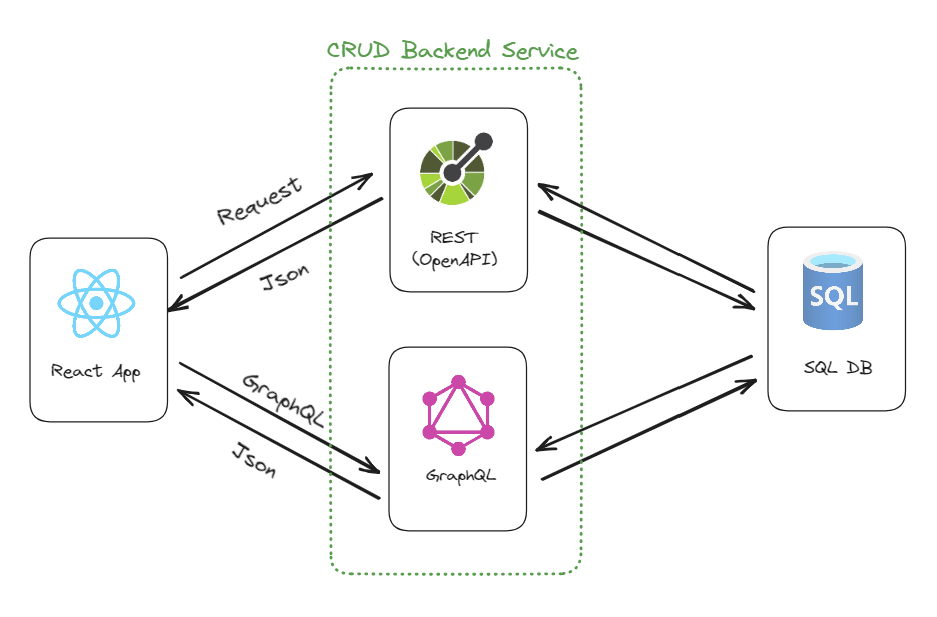

# Future Data Driven summit 2023

Demo for the session 

**From databases to API: an efficient solution both on-premises and in Azure**

Data API builder turns Azure Databases into REST a GraphQL API so that you can have the backend for your next modern application done in just a few minutes instead of days. With full support to authentication and authorization, integrated with Static Web Apps and easily scalable up and out – using API Management – Data API builder is something you really want to look at. Available both on Azure and on-premises, and Open Source, this is very likely to become your favorite tool. Come and learn everything about it!



## Run the demo locally

Make sure you have Node and [Static Web Apps CLI](https://azure.github.io/static-web-apps-cli/docs/use/install) installed. Then run:

```bash
npm install
```

Create a SQL Server or an Azure SQL database and run the script in the `./database` folder to create the `Sessions` and `Speakers` tables. Then create a `.env` file with the connection string to the database in the following format:

```bash
MSSQL='<your connection string>'
```

than the solution locally using SWA CLI

```bash
swa start swa start  --data-api-location .\swa-db-connections
```

## Deploy the demo to Azure

Follow the same steps for deploying an Azure Static Web App: [Tutorial: Deploy a React app on Azure Static Web Apps](https://learn.microsoft.com/en-us/azure/static-web-apps/deploy-react?pivots=github)